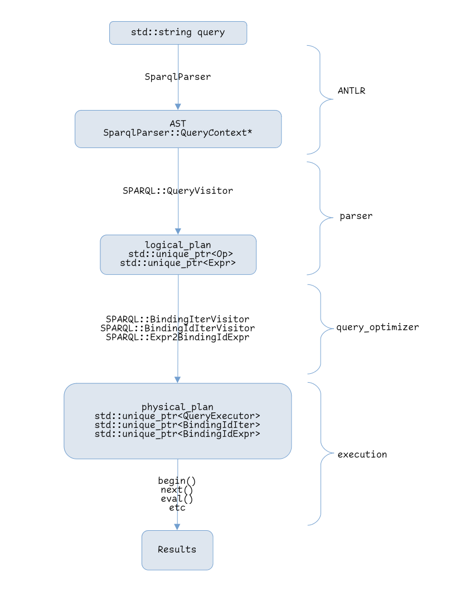

[SPARQL Architecture Overview](../../developer.md)
================================================================================


Table of Contents
================================================================================
- [Major Interfaces](#major-interfaces)
- [ObjectId](#objectid)
- [Namespaces](#namespaces)
- [High-level Execution Overview](#high-level-execution-overview)


[Major Interfaces](#sparql-architecture-overview)
================================================================================
Visitors
--------------------------------------------------------------------------------
- `QueryVisitor`: query -> logical plan (tree of `Op`s)
- `BindingIterVisitor`: Top level `Op` of logical plan -> `QueryExecutor` of physical plan
- `BindingIdIterVisitor`: `Op`s of logical plan -> `BindingIdIter`s of physical plan
- `Expr2BindingIdExpr`: `Expr`s of logical plan  -> `BindingIdExpr`s of physical plan


Operators and Expressions
--------------------------------------------------------------------------------
- `Op`: Operators of the logical plan
- `Expr`: Expressions of the logical plan
- `QueryExecutor`: The root operator of the physical plan
- `BindingIdIter`: Operators of physical plan
- `BindingIdExpr`: Expressions of physical plan


Explanation
--------------------------------------------------------------------------------
A visitor is a common pattern used to manipulate trees of nodes. In the case of MillenniumDB the operators and expression operations are nodes. The complete expressions, logical plan and physical plan are trees.

`QueryVisitor` is a visitor that visits the nodes of the AST of the query the user made and outputs the logical plan. The logical plan consists of a tree of `Op`s. The `Op`s are the logical operators, such as `SELECT` and `GROUP BY`. Some operators can contain expressions, those are represented by trees of `Expr`s. The creation of the physical plan is done by three visitors: `BindingIterVisitor`, `BindingIdIterVisitor` and `Expr2BindingIdExpr`. The `BindingIterVisitor` transforms top-level `Op`s (`SELECT`, `ASK`, `CONSTRUCT` and `DESCRIBE`) into their respective `QueryExecutor`s, which call the child physical operators and return output in the correct format (CSV, JSON, etc). The `BindingIdIterVisitor` transforms the logical operators (`Op`s) into physical operators (`BindingIdIter`). Any logical expressions (`Expr`s) in the logical plan are transformed into physical expressions (`BindingIdExpr`s) by the `Expr2BindingIdExpr` visitor. During execution of the query the `QueryExecutor` calls the tree of `BindingIdIter`s and any `BindingIdExprs` are evaluated.


[ObjectId](#sparql-architecture-overview)
================================================================================
Format
--------------------------------------------------------------------------------
The 64 bits of the `uint64_t` contained in `ObjectId` are assigned as follows:
```text
[1 byte type][7 bytes of content]
```
The type field indicates the type of the `ObjectId`, and the content field holds the contents of the `ObjectId`. The content field can directly hold the value of the `ObjectId` (inline) or contain some Id to reference externally saved data.

The format of the type field is the following:
```text
[4 bits generic type][2 bits sub-type][2 bits mod]
```
- The generic type field, as it's naming suggests, indicates the generic type of the `ObjectId`. Examples are: null, string, numeric.
- The sub-type field divides the generic types into multiple sub-types such as: strings with language, integers, decimals.
- The mod field divides sub-types into specific types such as: inlined string with language, external string with language, positive integers, negative integers, inlined decimals, external decimals.

The complete field specifies a specific type.

The meaning of the `MOD` field is usually:

| Value  | Meaning   |
|:------:|-----------|
| `0b00` | inline    |
| `0b01` | external  |
| `0b10` | temporary |

However, in some cases the `MOD` field is used for arbitrary sub-type division into specific types. Currently, the only example of this is the division of integers into negative and positive integers.


Type field examples
--------------------------------------------------------------------------------
### Integer
```text
0b0101'00'00 // Negative integer
0b0101'00'01 // Positive integer
```
The first four bits (`0b0101`) indicate the generic type, in this case "numeric". The following two bits (`0b00`) indicate the sub-type, in this case "integer". Finally, the las two bits differentiate between negative (`0b00`) and positive (`0b01`) integers.

### External string with language
```text
0b0100'01'01 // External string with language
```
The first four bits (`0b0100`) indicate the generic type, in this case "string". The following two bits (`0b01`) indicate the sub-type, in this case "string with language". Finally, the las two bits (`0b01`) follow the MOD convention and indicate that the string with language is saved externally. That means that the string is saved externally and the following 7 bytes of the `ObjectId` hold the Id of the string and not directly it's characters, along with an Id indicating the language of the string.

For a detailed description of the content field for each type check the documentation in `datatypes` directory.


Type comparisons
--------------------------------------------------------------------------------
The new `ObjectId` format has `GENERIC`, `SUBTYPE` and `TYPE` masks, the masks are labeled with the mask type in `object_id.h`. Comparing types and masks should be done in the following ways:
- The result of `oid.get_generic_type()` should only be compared with masks labeled as `GENERIC`.
- The result of `oid.get_sub_type()` should only be compared with masks labeled as `SUBTYPE`.
- The result of `oid.get_type()` should only be compared with masks labeled as `TYPE`.


Conversions and numeric expression evaluation
--------------------------------------------------------------------------------
`ObjectId` conversions (packing and unpacking of `ObjectId`s) are in `object_id_conversions.h`.

### Steps to evaluate a numeric expression:
- Calculate the datatype the operation should use (`calculate_optype()`)
- Unpack operands (`unpack_x()`)
- Convert operands to previously calculated datatype
- Evaluate operation
- Pack result (`pack_x()`)

### Type promotion and type substitution are done in the following order:

`integer -> decimal -> float -> double`

Note: `ObjectId`s of type double do not currently exists in MillenniumDB because they can not be inlined into `ObjectId` due to their size.

### Conversions can be done using the following:
- `int64_t` -> `Decimal`: `Decimal` constructor
- `int64_t` -> `float`: static_cast
- `int64_t` -> `double`: static_cast
- `Decimal` -> `float`: `Decimal.to_float()`
- `Decimal` -> `double`: `Decimal.to_double()`
- `float` -> `double`: static_cast


[UnifiedStorage](#sparql-architecture-overview)
================================================================================
There are two "string managers" that allow storing strings:
- `StringManager` manages external strings that are in the database.
- `TemporalManager` manages strings that need to be temporarily stored, such as strings inside queries.

In many places during the parsing, processing and execution of a query temporary strings need to be managed. When creating a new string the `StringManager` has to be checked if it already exists, then the `TemporalManager` has to be checked. Finally, when the string is in neither, it has to be created by the `TemporalManager`. When strings are retrieved, both the `StringManager` and the `TemporalManager` need to be checked. The creating and looking up of strings has to be done a lot, in many places. Each time the code is identical. Additionally, in some cases such as languages and datatype strings, the `ObjectId` does not store if those strings are temporary or not. The solution is to use one bit of the string ID to specify whether it is external or temporary.

The `UnifiedStorage` class manges all or the previous issues:
- checking the managers before creating temporary strings
- checking the managers when retrieving a string
- managing the IDs to differentiate external and temporary strings in the cases such as languages and datatypes.

This means that during query execution the `UnifiedStorage` class should generally be used instead of directly the `StringManager` or `TemporalManager`.


[Namespaces](#sparql-architecture-overview)
================================================================================
| Type       | Prefix | Meaning                                                  |
|------------|--------|----------------------------------------------------------|
| Blank Node | `_:c`  | temporary blank node                                     |
| Blank Node | `_:b`  | permanent blank node                                     |
| Variable   | `.`    | temporary internal variable                              |
| Variable   | `_:.b` | temporary internal variable associated with a blank node |
| Variable   | `.p`   | temporary internal path variable                         |


[High-level Execution Overview](#sparql-architecture-overview)
================================================================================

