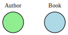
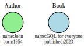
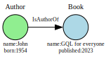
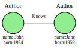

Property graphs
###############

A property graph is a data model for graph databases.

In this data model, the entities in the database are represented with **nodes** and relationships are represented with **directed** or **undirected edges** . Nodes and edges can have properties and labels. A property is a key-value pair and a label is used to represent a category or a class.

This representation of data is useful for modeling transfers or paths.

For example, we want to model authors and books using a property graph. Authors and books are represented by nodes. We distinguish them using labels.

A node can have multiple labels. The information of each node can be stored as properties.

Now we want to represent that an author has written a book. We do that using directed edges between two nodes.

We want to represent that two authors know each other. We can do that using undirected edges between two nodes.

To access the database, we can use a query language like GQL.
